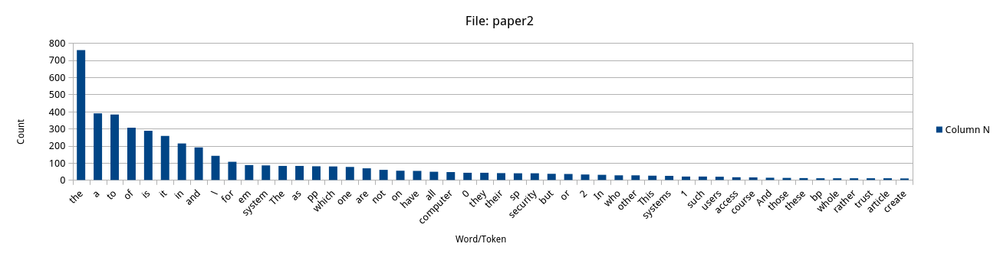

# Project 1: Multithreading and Multiprocessing

## Overview

The goal of this project is to create a multithreaded, multiprocessing approach to count a variable number of words in seven given files. The files vary in formatting, type, and size. Each file must be read in its own process and each file must be partioned into sections for threads to read. One word or a set of words will be counted and then relayed back to the parent process.

## Structure of code

### Process Management

The first process forks seven child processes that all return when they are done processing their document. While the seven child processes are working, the parent process waits for them to finish. Once a child process has finished counting the words, it pipes the word along with the count to the parent process. The data sits in a buffer until the parent reads from its end of the pipe. Once all of the child processes have executed, the parent reads from each pipe and prints the word and count.

### IPC Mechanism
The only IPC used are pipes. There isn't any synchronization since the child sends all of its data once, then the parent reads it once. The only necessary step is that the parent waits until all child processes have finished before reading the pipes.

### Threading
The threading structure is broken up into two parts. The ReadFile thread is the first thread created in each process. It opens the file and gets the file size. It then partions the file based on how many threads will be reading the file. If there are four threads, then there will be four paritions. A struct is used to hold the parameters for a ReadFileSection thread. Each struct holds the starting byte to read and how many bytes to read. It also includes the file path of the file to read. A for loop is used to create each of the parameter structs, then creates a ReadFileSection thread for each section. Each ReadFileThread counts the number of words in the g_words, and adds it to a local countWords array. After all of the words have been counted, the local count words array values are added to the g_countWords array. Only one thread can access the g_countWords array at a time since it is wrapped with a mutex. After all of of the ReadFileSection threads have finished, the ReadFile thread closes and the child process sends the words and counts to the parent process.

An additional feature of the ReadFile thread is that it can create a g_words array of unique words found in the file. If NUM_WORDS is set to 100 and ALL_WORDS is defined, then if there are 100 unique words in the file, they will be added to the g_words array.  **Note: There is currently a bug with this feature when NUM_WORDS is set to a large value**. Then the normal processing will be carried out by ReadFileSection, and the top 50 word counts will be sent to the parent process.

### Error Handling

Error handling is carried out when a process is created, when a thread is created or joined, when IPC mechanisms are initiated, and when a file is being read from. Buffer overflows are prevented by limiting loops to the size of the buffer. There is no user input, so all inputs can be determined at compile time.

### Performance Evaluation

The following trials were taken by setting the number of file divisions to one and five.

#### Select Words
Words: "the", "it", "be"

Threads: 1

Average time after 10 trials: 0.001710 seconds

Threads: 5

Average time after 10 trials: 0.001547 seconds

#### Find Top 50 Words

Processed 100 unique words. Chose the top 50.

Threads: 1

Average time after 10 trials: 0.003955 seconds

Threads: 5

Average time after 10 trials: 0.0034989 seconds

#### Results
There is a slight performance boost when using multiple threads to count words, but is almost neglible. It took a little more than double the time to process 100 words vs 3. This includes the additional step of finding the 100 unique words in the document. This means that the main performance boost is coming from the multiprocessing rather than the multithreading. This is becuase time isnt scaling linearly with the number of words processed, and there is only a slight improvement with multithreading. Since each process can run independently, the additional step of finding the 100 unique words adds less time, as well as the counting of words.

## Top 50 Words

# How to Run the Code
If you would like to run the code for yourself, ensure that the files are in the same directory that the c file is in. To run the Top 50 words test, define ALL_WORDS as 1 and comment out CHOOSE_WORDS. Set the NUM_WORDS to the max number of unique words. Set NUM_THREADS to the number of file partitions to count in parallel. Run the program.

To find words of your choosing, comment out ALL_WORDS and define CHOOSE_WORDS as 1. Add words to the g_words array under CHOOSE_WORDS. Set NUM_WORDS equal to the number of words in the g_words array. Change the thread number to the number of file partions to run in parallel. Run the program

# Discussion

This project was quite challenging to get working properly. A problem that took a while to solve was varying word counts when implementing two or more threads to count words. Before using strstr, I was using strtok, to tokenize the buffer. What I didn't realize is that the function is not thread safe. strtok holds an internal address of where the current token is in the buffer. This is shared among threads, so if two threads try to read different sections of the buffer, it causes problems. This problem took the longest to solve and lead me to restructuring the code before figuring it out. There were several other problems that I dealt with that ended up being thread synchronization issues. To get multithreading and multiprocessing right requires constent builds at each step because it can be quite challenging to find synchronization issues when alot of code has been implemented.

